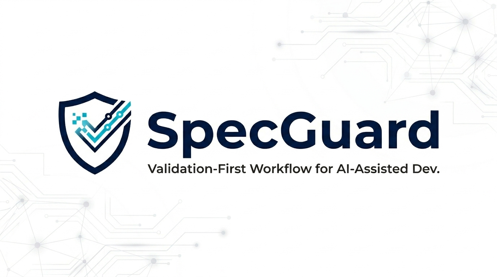
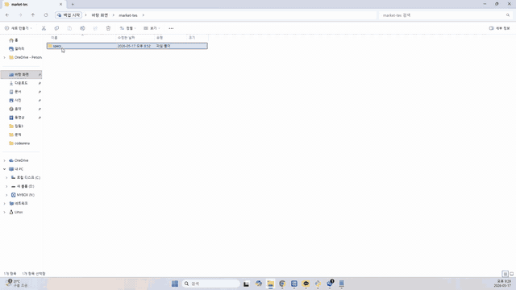

[한국어](README.ko.md) | [English](README.md)



# SpecGuard

**SpecGuard는 약한 스펙이 AI 코딩 에이전트에 전달되어 결함 있는 코드가 되기 전에 막는 검증 우선 워크플로입니다.**

SpecGuard는 AI 보조 개발을 위한 Validation-First Workflow (VFW)입니다. 구현이 시작되기 전에 스펙을 검토 가능하고, 테스트 가능하며, 구현에 넘길 수 있는 패키지로 정리합니다.

SpecGuard는 프롬프트를 바로 코드로 바꾸는 도구가 아닙니다. 사용자가 승인한 스펙 패키지를 준비한 뒤, 외부 Codex, Claude Code, 또는 다른 코딩 에이전트가 그 입력을 사용해 애플리케이션 코드를 작성하도록 돕습니다.

## 언어 지원

배포 패키지의 기본 README는 [README.md](README.md)입니다. 이 파일은 한국어 사용자를 위한 README 진입점이며, 영어 README와 같은 설정, 워크플로, 플러그인, 벤치마크, 정책 문서로 연결됩니다.

이번 언어 분리는 문서 범위의 변경입니다. 전체 CLI 출력 현지화, 런타임 동작 확장, 한국어 프로덕션 지원 확대를 의미하지 않습니다. 한국어 벤치마크 주장은 [Language Support](docs/language-support.md)와 [Spec-Driven Benchmark](docs/spec-driven-benchmark.md)에 기록된 결정적 low-mode 측정 근거 안에서만 설명합니다.

## 데모 영상



[고해상도 MP4 데모 보기](assets/specguard-demo-v0.4.0.mp4)

데모 흐름은 다음과 같습니다.

1. `pip install spec-guard`로 SpecGuard를 설치합니다.
2. `specguard example copy your-feature-name --force`로 예제 스펙을 복사합니다.
3. 취약한 스펙을 넣습니다. v0.3.0 예제 패키지는 차단되는 SpecGuard Review를 보여주기 위해 의도적으로 취약한 스펙을 기본 포함합니다.
4. SpecGuard findings를 확인합니다.
5. 약한 부분을 직접 고치거나, SpecGuard Review findings를 AI 어시스턴트에 전달해 스펙 강화를 요청합니다.
6. SpecGuard Review를 다시 실행하고 구현 handoff 전에 READY 또는 READY_WITH_WARNINGS에 도달했는지 확인합니다.

예제 패키지는 테스트용입니다. 실제 개발에서는 예제에 의존하지 말고 `specs/<your-feature-name>/` 또는 중첩 모듈의 `specs/<your-feature-name>/` 아래에 제품 스펙을 작성합니다.

## 워크플로 한눈에 보기

```text
Discovery -> Spec Package -> Technical Design -> SpecGuard Review
-> Test -> Contract -> Implementation Handoff
-> External AI Implementation -> Pull Request -> SpecGuard PR Review
```

SpecGuard는 Implementation Handoff까지의 검증 경로를 담당합니다. 그 이후 구현은 사용자 또는 외부 코딩 에이전트가 담당하며, SpecGuard PR Review는 pull request diff를 승인된 스펙 패키지와 비교할 수 있습니다.

## 핵심 리뷰

SpecGuard에는 두 가지 리뷰 체크포인트가 있습니다.

- `SpecGuard Review`는 구현 전에 실행됩니다. 기본 low mode는 빠른 heuristic review를 사용하며, Critical finding은 차단하고 Major 또는 Minor finding은 warning으로 보고합니다.
- `SpecGuard PR Review`는 구현 후 실행됩니다. 승인된 스펙 패키지와 implementation handoff를 pull request diff와 비교한 뒤 advisory review comment를 남깁니다.

Review level, LLM detail review, cache behavior, experimental Spec Revision은 [Core Reviews](docs/core-reviews.md)를 참고하세요.

## 설치와 사용자 흐름

가장 짧은 설치와 실행 경로는 다음과 같습니다.

```bash
pip install spec-guard
specguard auth setup --mode codex --model gpt-5.4
specguard init your-feature-name

# 선택 사항: 직접 스펙을 작성하기 전에 패키지 예제를 테스트합니다.
specguard example copy your-feature-name --force

specguard run specs/your-feature-name
```

SpecGuard는 Python 3.11 이상을 기대합니다. 기본 low `specguard run` 경로는 fast heuristic SpecGuard Review를 먼저 사용하므로 provider 설정 없이도 동작할 수 있습니다. Codex 설정은 LLM Discovery, LLM Technical Design, `specguard run --llm`, follow-up detail review, experimental Spec Revision, Strict E2E, SpecGuard PR Review setup 같은 LLM-backed 단계가 필요할 때 사용합니다.

`specguard init your-feature-name`은 기본 스펙 패키지와 `SpecGuard Readiness Gate` GitHub Actions workflow를 만듭니다. 실제 작업에서는 `specs/your-feature-name/` 아래의 draft를 제품 동작, API 또는 UI 기대값, 데이터 소유권, 권한 규칙, 상태 전이, 오류 케이스, acceptance criteria로 강화한 뒤 검증합니다.

`specguard run specs/your-feature-name`이 READY 또는 READY_WITH_WARNINGS를 보고하면 `implementation-output.md`를 외부 코딩 에이전트에 전달해 스펙 기반 구현을 시작합니다. Critical finding이 남아 NOT_READY인 경우에는 스펙을 의도적으로 수정하고 다시 실행합니다.

자세한 설치, 예제 패키지, LLM review option, follow-up menu, implementation handoff, PR review setup은 [Setup To User Flow](docs/setup-to-user-flow.md)를 참고하세요.

## Codex App Plugin

SpecGuard는 `plugins/specguard/` 아래에 Codex plugin scaffold를 포함합니다. 이 플러그인은 CLI를 대체하지 않습니다. Codex가 기존 `specguard` 명령을 실행하고, 구조화된 readiness artifact를 읽고, 다음 행동을 요약하도록 돕습니다.

지원 버전은 Python 3.11, 3.12, 3.13이며, `codex plugin marketplace`를 지원하는 Codex CLI가 필요합니다. 이 설정은 Codex CLI 0.130.0에서 검증되었습니다.

Codex app에서 사용하는 흐름은 다음과 같습니다.

1. Codex가 실행될 환경에 SpecGuard CLI를 설치합니다.

   ```bash
   pip install spec-guard
   specguard --help
   ```

2. repo-scoped SpecGuard marketplace를 추가합니다.

   ```bash
   codex plugin marketplace add KoreaNirsa/spec-guard --ref main
   ```

3. Codex를 재시작하거나 refresh합니다.
4. Codex plugin directory에서 `SpecGuard Plugins` source를 선택하고 `SpecGuard`를 설치합니다.
5. 대상 프로젝트 폴더를 준비합니다.

   ```bash
   mkdir your-codex-project-folder
   cd your-codex-project-folder
   ```

6. 테스트용 spec package를 준비합니다.

   ```bash
   specguard example copy specs/your-feature-name --force
   ```

7. Codex에서 `your-codex-project-folder`를 열고 다음처럼 요청합니다.

   ```text
   Run SpecGuard on specs/your-feature-name.
   ```

기본 플러그인 경로는 heuristic CLI gate입니다.

```bash
specguard run <package> --no-llm --no-follow-up
```

플러그인을 설치해도 SpecGuard CLI가 자동 설치되지는 않습니다. 이 marketplace는 custom repository marketplace이며 official OpenAI Plugin Directory가 아닙니다. 설정 상세, validation scenario, plugin boundary는 [Codex Plugin Guide](docs/codex-plugin.md)를 참고하세요.

## 스펙 패키지 해석

SpecGuard는 `**/specs/<feature>/spec.md` 형태의 디렉터리를 패키지로 해석합니다. 루트 `specs/<feature>/` 레이아웃과 `services/api/specs/<feature>/` 같은 중첩 모듈 레이아웃을 모두 지원합니다.

명령에 `spec.md`를 포함한 명시적 패키지 경로가 전달되면 그 패키지를 사용합니다. repository tree 또는 `specs` root가 전달되면 candidate package를 검색합니다. candidate가 정확히 하나면 결정적으로 사용하고, 여러 개면 잘못된 패키지를 고르지 않도록 명시적 package path로 다시 실행하라고 보고합니다.

Discovery는 `.git`, `.venv`, `node_modules`, `vendor`, `build`, `dist`, `target`, `out`, `coverage`, `htmlcov`, `generated`, `__generated__`, `__pycache__` 같은 hidden, dependency, build, generated directory를 건너뜁니다.

## 벤치마크 요약과 한계

기록된 v0.4.1 gate-only benchmark는 auth, billing, document sharing, webhooks, payments, inventory, support, admin roles, privacy, API keys, SSO, cache, returns, ledger, promotions, background jobs 같은 실무 도메인의 영어 스펙 패키지 99개를 평가합니다. 대응되는 한국어 gate-only case 99개도 포함하며, 영어와 한국어 metric을 분리해 보고합니다.

현재 fixture source에는 영어 104개와 한국어 104개 case가 있습니다. 새로 추가되었거나 이전에 pending이던 10개 fixture result는 다음 benchmark refresh 전까지 v0.4.1 artifact에 포함되지 않으므로, 아래 표는 기록된 v0.4.1 artifact만 설명합니다.

| Gate-Only Guard Signal | English 99 | Korean 99 |
| --- | ---: | ---: |
| Weak specs blocked before implementation | 65/65 | 65/65 |
| Weak-spec block rate | 100.0% | 100.0% |
| Ready specs incorrectly blocked | 0/34 | 0/34 |
| False positive rate | 0.0% | 0.0% |
| Weak specs missed | 0/65 | 0/65 |
| False negative rate | 0.0% | 0.0% |

원래 #136 code-generation baseline에서는 raw weak spec이 12개 중 11개 case에서 contract defect를 노출했습니다. Calibrated local gate에서는 SpecGuard가 구현 handoff 전에 관찰된 11개 exposure path를 모두 차단해 prevented exposure를 27.3%에서 100.0%로 높였습니다.

이 주장은 pre-implementation guard layer에 대한 것입니다. Supplemental과 extended gate-only suite는 Codex generation을 새로 실행하지 않았으므로 post-gate code defect rate를 주장하지 않습니다.

한국어 지원은 explicit unsafe wording에 대한 deterministic low-mode claim입니다. 전체 한국어 프로덕션 지원, 모든 한국어 관용 표현 검증, LLM-backed 한국어 review 품질, 전체 CLI 현지화 주장은 하지 않습니다. 자세한 methodology, suite breakdown, case-level result, version metadata, limitation은 [Spec-Driven Benchmark](docs/spec-driven-benchmark.md)와 [Language Support](docs/language-support.md)를 참고하세요.

## 핵심 가치

AI 코딩은 구현 입력이 명확할 때 가장 잘 작동합니다. SpecGuard는 코드가 작성되기 전에 자주 실패하는 부분에 집중합니다.

- 불명확한 요구사항
- 숨은 가정
- 빠진 authorization 또는 ownership rule
- 약한 acceptance criteria
- 정의되지 않은 error, retry, timeout, state transition
- 의도한 동작과 맞지 않는 contract

스펙의 소유자는 사용자입니다. SpecGuard는 그 스펙을 중심으로 구현 기반을 draft, challenge, validate합니다.

## 문서

- [English README](README.md): 배포 패키지의 기본 README와 영어 진입점입니다.
- [Setup To User Flow](docs/setup-to-user-flow.md): installation, Codex setup, example package, validation loop, implementation handoff, PR review setup.
- [Core Reviews](docs/core-reviews.md): SpecGuard Review, SpecGuard PR Review, LLM detail review, cache behavior, experimental Spec Revision.
- [Language Support](docs/language-support.md): 한국어 기본 문서 지원, 영어 지원, 문서 상태, 한국어 benchmark claim boundary.
- [Codex Plugin Guide](docs/codex-plugin.md): Codex app plugin setup, MVP workflow, validation scenario, plugin boundary.
- [Plugin Examples And Contributor Fixtures](docs/plugin-examples.md): packaged example scope와 contributor-only plugin scenario fixture.
- [Plugin Result Contract](docs/plugin-result-contract.md): Codex plugin consumer가 사용할 수 있는 안정적인 `readiness-review.json` field와 file-based state.
- [Readiness Rules](docs/readiness-rules.md): review level, READY threshold, contract requirement, Strict E2E verification rule.
- [CI And PR Gates](docs/ci-and-pr-gates.md): readiness gate installation, required-check guidance, PR review separation.
- [CLI Reference](docs/cli-reference.md): common command, `run` option, CI-friendly example.
- [Development](docs/development.md): local source setup, test, packaged-example smoke testing.
- [Workflow Guide](docs/workflow.md)
- [Discovery Guide](docs/deep-discovery.md)
- [Spec-Driven Benchmark](docs/spec-driven-benchmark.md)
- [Readiness Coverage Audit](docs/readiness-coverage-audit.md)
- [Contributing](CONTRIBUTING.md)

## License

Apache License 2.0
