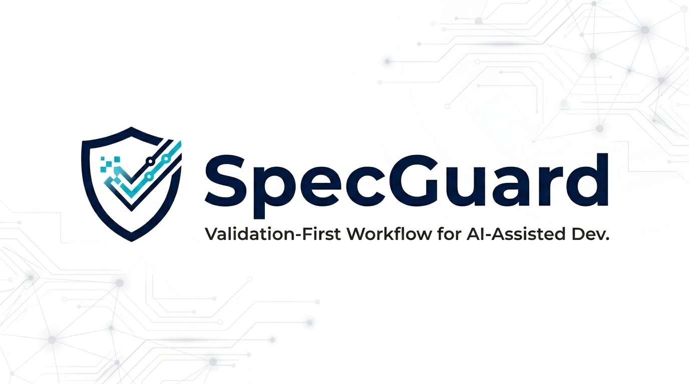

# SpecGuard

SpecGuard is a validation-first workflow for AI-assisted software development.

It is not a prompt-to-code generator. SpecGuard helps you turn an idea into a reviewed, testable, implementation-ready spec package before an external Codex, Claude Code, or another coding agent writes application code.

```text
Discovery -> Spec Package -> Technical Design -> SpecGuard Review
-> Test -> Contract -> Implementation Handoff
-> External AI Implementation -> Pull Request -> SpecGuard PR Review
```

## Setup To User Flow

This is the shortest path from a fresh clone to a reviewed implementation PR.

### 1. Clone And Install

SpecGuard expects Python 3.11 or newer.

```bash
git clone https://github.com/KoreaNirsa/spec-guard.git
cd spec-guard
python -m pip install -r requirements.txt
```

Optional, if you want the `specguard` console command in addition to `python -m cli.specguard`:

```bash
python -m pip install -e .
```

### 2. Configure Codex

Then configure SpecGuard to use local Codex:

```bash
python -m cli.specguard auth setup --mode codex --model gpt-5.4
python -m cli.specguard auth status
```

If Codex is already logged in and you do not want setup to offer `codex login`:

```bash
python -m cli.specguard auth setup --mode codex --model gpt-5.4 --skip-login
```


### 3. Create A Feature Spec

```bash
python -m cli.specguard init your-feature-name
```

SpecGuard writes draft artifacts under:

```text
specs/your-feature-name/
|-- discovery.md
|-- spec.md
|-- plan.md
|-- tasks.md
|-- constitution.md
`-- checklists/spec-readiness.md
```

For real work, this is where the user writes the actual development spec. Strengthen `specs/your-feature-name/` with product behavior, API or UI expectations, data ownership, authorization rules, state transitions, error cases, and acceptance criteria before running validation.

### 4. Try The Example Specs

This step assumes Codex login and SpecGuard auth setup already succeeded in step 2. Use it when you want to test the normal `init -> run` flow with an authored example spec package before writing your own feature spec.

PowerShell:

```powershell
Copy-Item -Recurse -Force example\* specs\your-feature-name\
```

Bash:

```bash
cp -R example/. specs/your-feature-name/
```

This exercises the same Codex-backed validation path that a real feature spec will use.

### 5. Run And Iterate Until READY

```bash
python -m cli.specguard run specs/your-feature-name
```

`run` builds and validates the implementation basis:

```text
Technical Design -> Initial SpecGuard Review -> Test -> Contract -> Implementation Handoff
```

If SpecGuard returns NOT READY, use the continuation menu:

```text
[1] View Readiness Findings
[2] Regenerate spec from Readiness Findings (auto-runs SpecGuard Review after)
[q] Exit
```

Repeat until SpecGuard reports READY.

For LLM-enabled strict automation:

```bash
python -m cli.specguard run specs/your-feature-name --strict-e2e --strict-max-iterations 3
```

Strict E2E runs Initial SpecGuard Review first, regenerates `spec.md` from blockers, reruns Verification Review, and stops only when READY or when the iteration limit is exhausted. It writes `strict-e2e-trace.json` for traceability.

### 6. Implement With An External AI Coding Agent

When READY, SpecGuard writes:

```text
specs/your-feature-name/implementation-output.md
```

SpecGuard stops here. It does not invoke Codex, Claude Code, or another coding agent as an internal implementation stage.

Give the approved spec package and `implementation-output.md` to your external coding agent. The generated application code should live under `develop/<stack>/`, for example:

```text
develop/spring/
develop/react/
develop/fastapi/
```

### 7. Open A Pull Request And Run SpecGuard PR Review

After implementation, open a PR in your GitHub repository with the completed code.

The optional `SpecGuard PR Review` workflow compares the approved spec package to the PR diff and posts one advisory PR comment headed `SpecGuard PR Reviewer`.

To enable the default GitHub Actions path, add this repository secret in GitHub repository settings:

```text
SPECGUARD_OPENAI_API_KEY=sk-...
```

Add optional repository variables when you want to choose the review model or force the reviewer to use a specific spec package:

```text
SPECGUARD_PR_REVIEW_MODEL=gpt-5.4-nano
SPECGUARD_REVIEW_SPEC_PATHS=specs/your-feature-name
```

`SPECGUARD_OPENAI_API_KEY` must be stored as a GitHub Actions secret, not committed to the repository. Use `SPECGUARD_REVIEW_SPEC_PATHS` when an implementation PR changes only `develop/<stack>/` files and does not modify files under `specs/`.

The workflow is advisory by default. If credentials are unavailable, if the selected spec package is NOT READY, or if the readiness report is stale, the workflow skips or reports the blocker instead of invoking the reviewer.

## Core Value

AI coding works best when the implementation input is explicit. SpecGuard focuses on the parts that often fail before code is written:

- unclear requirements
- hidden assumptions
- missing authorization or ownership rules
- weak acceptance criteria
- undefined errors, retries, timeouts, and state transitions
- contracts that do not match the intended behavior

The user owns the spec. SpecGuard drafts, challenges, and validates the implementation basis around it.

## Readiness Rules

SpecGuard uses this readiness threshold:

- Critical: 0
- Major: 0
- Minor: 5 or fewer

Critical and Major findings block implementation. Minor findings are allowed only when they do not hide missing requirements or implementation ambiguity.

For API features, `contracts/openapi.yaml` must define at least one concrete path before SpecGuard can produce an implementation handoff. `paths: {}` is treated as a blocker, not a ready contract. Generated contracts include spec-derived success and error responses, request and response schemas, and `x-specguard-coverage` links back to acceptance criteria and error cases.

Strict E2E also requires executable verification before handoff. Add tests such as `tests/test_*.py`, or document an accepted `tests/verification-contract.md` with the command or artifact that a coding agent must preserve.

## CI And PR Gates

Pull request CI includes a stable required-check candidate named `SpecGuard Readiness Gate`. It inspects changed packages under `specs/`, fails when a changed package is NOT READY, and fails when source artifacts are stale relative to `readiness-review.json`.

Repositories that want merge-time enforcement should add `SpecGuard Readiness Gate` to branch protection or ruleset required status checks.

`SpecGuard PR Review` is separate from the readiness gate. It is a post-implementation advisory review that checks whether code appears aligned with the approved spec package.

## CLI Reference

```bash
python -m cli.specguard init <spec-name>
python -m cli.specguard run specs/<spec-name>
python -m cli.specguard auth status
```

Useful `run` options:

- `--force`: regenerate derived artifacts such as technical design.
- `--follow-up`: force the interactive continuation menu.
- `--no-follow-up`: exit immediately after the pipeline.
- `--no-llm`: use local deterministic checks and heuristic SpecGuard Review.
- `--strict-e2e`: use an LLM to automatically regenerate blocked specs and rerun Verification Review.
- `--strict-max-iterations`: bound the number of strict E2E verification iterations.

CI or scripted example:

```bash
python -m cli.specguard init billing-export --non-interactive --no-llm
python -m cli.specguard run specs/billing-export --no-llm --no-follow-up
```

## Development

Run tests:

```bash
python -m pytest
```

Use the example flow above when you want to exercise SpecGuard with the configured Codex provider.

## Documentation

- [Workflow Guide](docs/workflow.md)
- [Discovery Guide](docs/deep-discovery.md)
- [Contributing](CONTRIBUTING.md)

## License

Apache License 2.0
