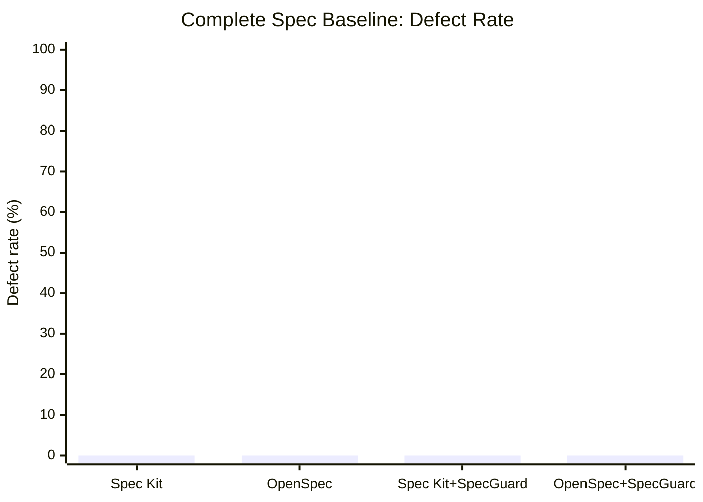
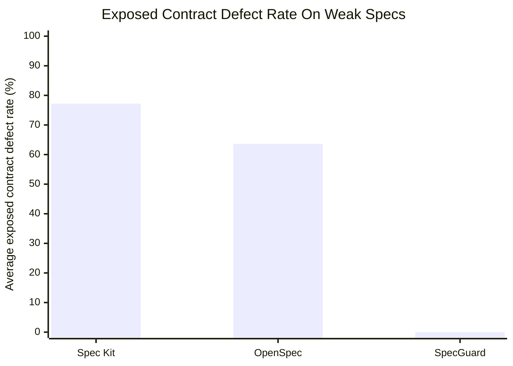
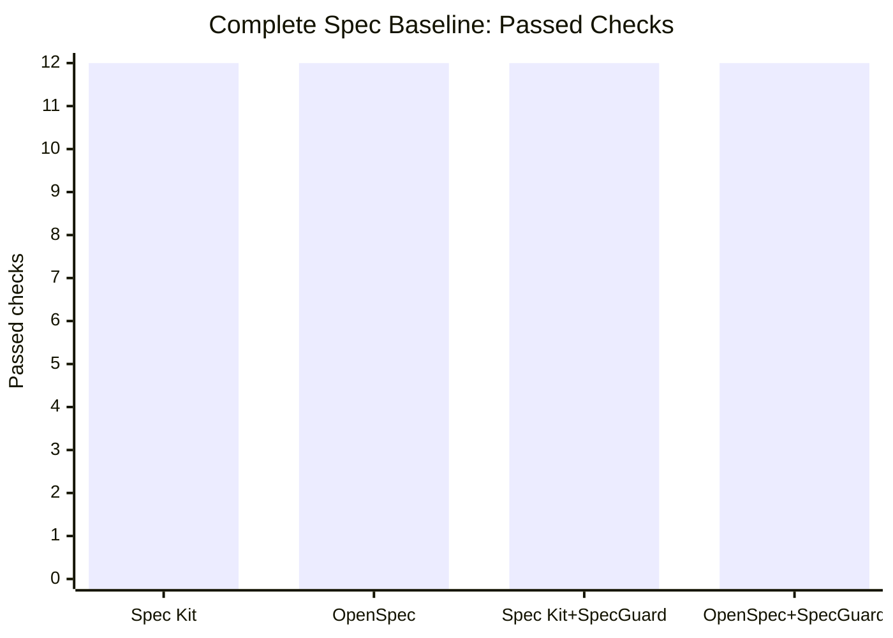
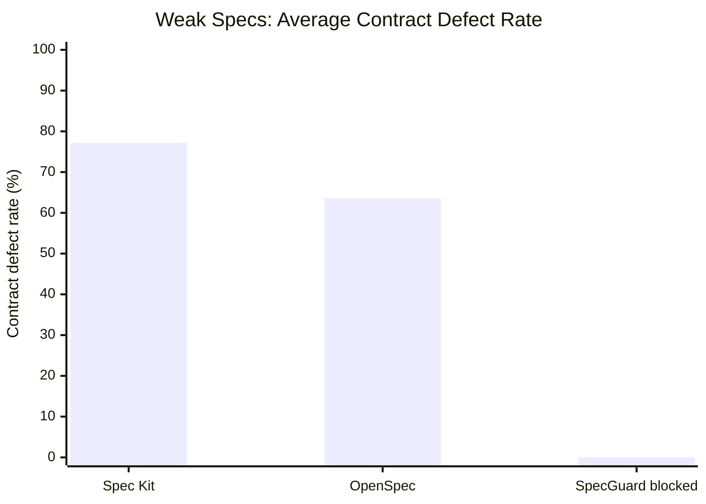

# Spec-Driven Development Benchmark: Spec Kit, OpenSpec, and SpecGuard

## Purpose

This benchmark compares Spec Kit, OpenSpec, and SpecGuard in spec-driven AI coding workflows.

The focus is not whether a model can generate runnable code from a clear prompt. The focus is whether each workflow protects the implementation from weak, incomplete, or defective specs before those specs become code.

The benchmark evaluates:

- whether generated code satisfies the functional requirements
- whether generated code stays within the response and error contracts
- whether ownership, state transitions, deletion semantics, and idempotency are preserved
- whether defective or incomplete specs are blocked before implementation
- whether SpecGuard reduces exposed contract defects when AI coding is driven by poor specs

## Executive Summary

With a complete and explicit spec, Codex `gpt-5.5` generated code that passed all hidden contract checks across all tested workflows.

| Workflow | Passed | Failed | Defect Rate | Result |
| --- | ---: | ---: | ---: | --- |
| Spec Kit | 12 | 0 | 0% | Pass |
| OpenSpec | 12 | 0 | 0% | Pass |
| Spec Kit + SpecGuard | 12 | 0 | 0% | Pass |
| OpenSpec + SpecGuard | 12 | 0 | 0% | Pass |



That result is expected: when the spec is small, explicit, and internally consistent, the model has enough information to produce contract-compliant code.

The stronger signal appeared in the defective and incomplete spec benchmark. Spec Kit and OpenSpec both produced runnable code from every weak spec, but every generated implementation exposed contract defects. SpecGuard blocked the same six weak spec packages before implementation.

| Workflow | Defective or Incomplete Specs | Generated Implementations | Average Exposed Contract Defect Rate | Cases With Contract Defects | Blocked Before Implementation | Result |
| --- | ---: | ---: | ---: | ---: | ---: | --- |
| Spec Kit | 6 | 6 | 77.2% | 6/6 | 0/6 | Defective code exposed |
| OpenSpec | 6 | 6 | 63.6% | 6/6 | 0/6 | Defective code exposed |
| SpecGuard | 6 | 0 | N/A | 0/6 exposed | 6/6 | Implementation blocked |



SpecGuard's `0%` exposed defect rate does not mean it generated better code from bad specs. It means SpecGuard prevented bad specs from reaching the AI implementation step.

The practical conclusion is:

- Spec Kit and OpenSpec are useful for structuring spec-driven work.
- A strong model can implement well when the spec is already complete.
- When the spec is defective or incomplete, generated code can look structurally correct while still violating runtime contracts.
- SpecGuard's value is the validation gate: it blocks unsafe implementation inputs before an AI coding agent turns them into code.

## Evidence Levels

| Level | Meaning | Evidence Used Here |
| --- | --- | --- |
| E0 | Locally executed benchmark evidence | 16 Codex `gpt-5.5` code generation runs, hidden contract runners, and 10 SpecGuard readiness gate runs. The weak-spec SpecGuard gate used local `--no-llm` validation, not a Codex review. |
| E1 | Official project documentation | Spec Kit, OpenSpec, and SpecGuard workflow and artifact documentation |
| E2 | Analysis based on E0 and E1 | Defect-rate comparison, contract-risk interpretation, and workflow positioning |

Reference materials:

| Tool | Reference |
| --- | --- |
| Spec Kit | [github/spec-kit README](https://github.com/github/spec-kit), [Spec-Driven Development methodology](https://github.com/github/spec-kit/blob/main/spec-driven.md) |
| OpenSpec | [OpenSpec official site](https://openspec.dev/), [Fission-AI/OpenSpec README](https://github.com/Fission-AI/OpenSpec) |
| SpecGuard | [README](../README.md), [Workflow Guide](workflow.md) |

## Benchmark Environment

| Item | Value |
| --- | --- |
| Run date | 2026-05-06 |
| Code generation command | `npx @openai/codex@0.128.0 exec -m gpt-5.5` |
| SpecGuard weak-spec gate | `python -m cli.specguard run <temp-feature> --no-llm --no-follow-up` |
| Model | `gpt-5.5` |
| SpecGuard gate model | None. `--no-llm` uses local deterministic validation and heuristic readiness checks. |
| Reasoning effort | `low` |
| Implementation task | In-memory Python `TaskService` |
| Generated file | `task_service.py` |
| External runtime dependencies | None |
| Complete-spec evaluation | Python hidden contract runner with 12 checks |
| Weak-spec evaluation | Python hidden contract runner with 21 checks: 10 structure/runtime checks and 11 contract checks |
| Temporary project cleanup | Final benchmark roots reported `temp_removed=True` |

## Complete-Spec Baseline

The complete-spec baseline used the same canonical task spec across all workflows. The only workflow-specific difference was how the same requirements were packaged.

| Workflow | Input Shape | Spec Content |
| --- | --- | --- |
| Spec Kit | Spec Kit-style `spec.md`, `plan.md`, and `tasks.md` wrapper | Same canonical spec |
| OpenSpec | OpenSpec-style proposal, design, and spec delta wrapper | Same canonical spec |
| Spec Kit + SpecGuard | Spec Kit wrapper plus SpecGuard readiness, contract, and handoff artifacts | Same canonical spec |
| OpenSpec + SpecGuard | OpenSpec wrapper plus SpecGuard readiness, contract, and handoff artifacts | Same canonical spec |

The SpecGuard wrapper did not add new feature requirements. It only restated the same canonical spec as readiness, contract, verification, and handoff context.

### Canonical Contract Summary

| Area | Requirement |
| --- | --- |
| Public API | `TaskService`, `TaskError`, `create_task`, `list_tasks`, `complete_task`, `delete_task` |
| Success response | Exactly `schema_version`, `correlation_id`, `task_id`, `owner_user_id`, `title`, `status`, `created_at`, `updated_at` |
| Error response | Exactly `schema_version`, `correlation_id`, `error_code`, `message` |
| Error codes | `UNAUTHENTICATED`, `INVALID_TITLE`, `TASK_NOT_FOUND`, `IDEMPOTENCY_KEY_REUSED` |
| Validation | `user_id` and `title` are trimmed before validation |
| Ownership | Users cannot list, complete, or delete another user's task |
| State transitions | `open -> completed`, `completed -> completed`, `open/completed -> deleted` |
| Idempotency | Same user/key/title returns the same task; same user/key/different title is rejected |
| Out of scope | HTTP, database, repository layer, auth provider, background jobs |

### Complete-Spec Hidden Checks

The complete-spec benchmark used 12 hidden checks.

| No. | Check |
| ---: | --- |
| 1 | `create_task` response has exact fields; title and owner are trimmed |
| 2 | Blank title returns `INVALID_TITLE` with the flat error schema |
| 3 | Non-string title returns `INVALID_TITLE` |
| 4 | Title longer than 100 characters returns `INVALID_TITLE` |
| 5 | Blank user returns `UNAUTHENTICATED` |
| 6 | Non-string user returns `UNAUTHENTICATED` |
| 7 | Same idempotency key and title returns the same task id |
| 8 | Same idempotency key with a different title returns `IDEMPOTENCY_KEY_REUSED` |
| 9 | `list_tasks` enforces owner scope and hides deleted tasks |
| 10 | Cross-user complete returns `TASK_NOT_FOUND` |
| 11 | Completing an already completed task is idempotent |
| 12 | Deleted tasks are hidden and cannot be mutated later |

Defect-rate formula:

```text
defect_rate = failed_hidden_checks / total_hidden_checks * 100
```

### Complete-Spec Results

| Workflow | Model | Codex CLI | Generated | Elapsed | Passed | Failed | Defect Rate |
| --- | --- | --- | --- | ---: | ---: | ---: | ---: |
| Spec Kit | `gpt-5.5` | `0.128.0` | Yes | 94.9s | 12 | 0 | 0% |
| OpenSpec | `gpt-5.5` | `0.128.0` | Yes | 85.7s | 12 | 0 | 0% |
| Spec Kit + SpecGuard | `gpt-5.5` | `0.128.0` | Yes | 132.7s | 12 | 0 | 0% |
| OpenSpec + SpecGuard | `gpt-5.5` | `0.128.0` | Yes | 55.9s | 12 | 0 | 0% |



## Defective and Incomplete Spec Benchmark

The second benchmark intentionally used weak implementation inputs.

Spec Kit and OpenSpec received the weak specs and generated code with Codex `gpt-5.5`. SpecGuard received the same spec packages first and was evaluated on whether it allowed or blocked implementation. In this weak-spec gate benchmark, SpecGuard used `--no-llm`, so blocker detection came from local validation and heuristic readiness rules rather than from Codex.

### Reproducibility

The benchmark harness is included in [tools/spec_driven_ai_benchmark.py](../tools/spec_driven_ai_benchmark.py).

```bash
python tools/spec_driven_ai_benchmark.py
```

The script creates temporary benchmark projects, invokes Codex for Spec Kit and OpenSpec prompts, runs the hidden checker against generated `task_service.py` files, runs the local SpecGuard gate, and removes the temporary root.

### Why `--no-llm` Still Found Defects

`--no-llm` does not mean SpecGuard skips review. It means the pipeline does not call a model. The gate still runs local checks such as:

- required artifact and section validation
- placeholder detection in `spec.md` and `technical-design.md`
- heuristic readiness checks for missing ownership boundaries in Todo-style specs
- unsafe delete semantics
- external dependency failure paths without timeout, retry, or fallback policy
- incomplete state and failure-handling sections

In the incomplete-spec cases, SpecGuard blocked the package before readiness review because validation found placeholder or incomplete technical-design content. In the fault-injected cases, the local readiness heuristic produced `not_ready` findings. This is different from a Codex-based SpecGuard Review, which would require running without `--no-llm` after configuring a Codex provider.

### Why `--no-llm` Reduced the Exposed Defect Rate

The local gate did not make generated code better. It reduced the exposed defect rate by preventing code generation from starting when the implementation input was already unsafe.

That distinction is important:

| Mechanism | What Happened |
| --- | --- |
| Spec Kit and OpenSpec | Weak specs were handed directly to Codex `gpt-5.5`; Codex produced runnable code; hidden contract checks found runtime defects. |
| SpecGuard `--no-llm` gate | Weak specs were validated first; local checks returned `not_ready` or validation failure; no implementation was generated from those inputs. |

In other words, the measured improvement is an exposure-control improvement:

```text
exposed_contract_defect_rate =
  contract-defective implementations that reach runtime
  / implementations generated from weak specs
```

For Spec Kit and OpenSpec, weak specs produced runnable implementations, so contract defects were exposed. For SpecGuard, the same weak specs were blocked before implementation, so no contract-defective implementation reached the runtime checker.

This is a conservative result. It shows that even without LLM review, SpecGuard's deterministic and heuristic gate can catch a useful class of implementation blockers. It does not claim that local `--no-llm` review is as complete as a Codex-based SpecGuard Review.

### Weak-Spec Cases

| Category | Case | Spec Problem |
| --- | --- | --- |
| Fault injected | `fault_ownership_leak` | The spec incorrectly allows global task lookup and does not enforce owner scope for list/complete/delete |
| Fault injected | `fault_deleted_visible` | Deleted tasks remain visible and can still be completed |
| Fault injected | `fault_external_dependency` | The spec requires an external notification call but does not define failure behavior |
| Incomplete | `incomplete_error_contract` | Error schema, error codes, and correlation-id behavior are missing |
| Incomplete | `incomplete_idempotency` | Idempotency conflict behavior is unclear |
| Incomplete | `incomplete_state_transition` | State transitions and deleted-terminal behavior are not defined |

### Aggregate Results

| Workflow | Generated Code | Structure Quality | Average Contract Defect Rate | Cases With Contract Defects | SpecGuard Block Rate |
| --- | ---: | ---: | ---: | ---: | ---: |
| Spec Kit | 6 | 100.0% | 77.2% | 6/6 | 0% |
| OpenSpec | 6 | 100.0% | 63.6% | 6/6 | 0% |
| SpecGuard | 0 | N/A | N/A | 0/6 exposed | 100.0% |

Structure quality means the generated file existed, imported successfully, exposed `TaskService` and `TaskError`, and implemented the expected public methods. The important finding is that structurally valid code still violated the runtime contract in every weak-spec case.



### Fault-Injected Spec Results

| Case | Spec Kit Contract Defect Rate | OpenSpec Contract Defect Rate | SpecGuard Result |
| --- | ---: | ---: | --- |
| `fault_ownership_leak` | 63.6% | 63.6% | `not_ready`, implementation blocked |
| `fault_deleted_visible` | 63.6% | 54.5% | `not_ready`, implementation blocked |
| `fault_external_dependency` | 90.9% | 63.6% | `not_ready`, implementation blocked |

In the fault-injected cases, the model often followed the defective spec faithfully. For example, when the spec weakened ownership rules, generated code allowed cross-user operations. When the spec kept deleted tasks visible, generated code exposed deleted tasks through the public API.

### Incomplete Spec Results

| Case | Spec Kit Contract Defect Rate | OpenSpec Contract Defect Rate | SpecGuard Result |
| --- | ---: | ---: | --- |
| `incomplete_error_contract` | 81.8% | 81.8% | `validation_blocked`, implementation blocked |
| `incomplete_idempotency` | 81.8% | 54.5% | `validation_blocked`, implementation blocked |
| `incomplete_state_transition` | 81.8% | 63.6% | `validation_blocked`, implementation blocked |

In the incomplete cases, the generated code was runnable but failed to preserve important contracts such as the error envelope, idempotency conflict handling, and deleted-task terminal behavior. SpecGuard blocked these packages at validation time before a readiness report could approve implementation.

### Runtime Exposure

Contract-defect formula:

```text
contract_defect_rate = failed_contract_checks / total_contract_checks * 100
```

Runtime exposure summary:

| Workflow | Implementations Exposed To Runtime | Cases With Exposed Defects | Average Exposed Contract Defect Rate |
| --- | ---: | ---: | ---: |
| Spec Kit | 6 | 6/6 | 77.2% |
| OpenSpec | 6 | 6/6 | 63.6% |
| SpecGuard | 0 | 0/6 | 0% |

This is the core SpecGuard result: when implementation input is weak, SpecGuard prevents the defective implementation path from starting.

## Interpretation

### Code Quality Versus Contract Quality

The complete-spec benchmark did not show a code-quality difference. All workflows passed the same hidden contract checks.

The weak-spec benchmark showed a different failure mode. Spec Kit and OpenSpec generated structurally valid code in every case. The code was importable and exposed the expected public API, but it violated hidden runtime contracts in every case.

That distinction matters in real AI-assisted development. A generated implementation can look clean in review, satisfy the visible artifact shape, and still violate the intended product contract because the input spec was incomplete or wrong.

### What SpecGuard Adds

SpecGuard is not a better prompt-to-code generator. It is a validation gate for implementation input.

It asks:

- Is the implementation basis explicit enough for an AI coding agent?
- Are ownership, state, failure, idempotency, and contract rules testable?
- Does the spec force the model to guess?
- Is there a Critical or Major blocker that should stop implementation?
- Would generated code be allowed to reach runtime before these issues are resolved?

The benchmark supports the following positioning:

> SpecGuard is strongest when the risk is not model capability, but weak implementation input. It prevents incomplete or defective specs from being converted into runnable but contract-defective code.

## Final Assessment

| Question | Result |
| --- | --- |
| Was real code generated? | Yes. Spec Kit and OpenSpec generated Codex `gpt-5.5` code for the benchmark cases. |
| Was the same task domain used? | Yes. All cases used an in-memory Todo Task Service. |
| Was Codex `gpt-5.5` used? | Yes for code generation. The weak-spec SpecGuard gate used local `--no-llm` validation, not Codex. |
| Was defect rate measured? | Yes. Hidden contract runners measured runtime and contract defects. |
| Were temporary projects removed? | Yes. Final benchmark roots reported cleanup success. |
| Which workflow generated the best code on the complete spec? | No winner. All workflows passed. |
| Which workflow performed best on weak specs? | SpecGuard, because it blocked 6/6 weak specs before implementation. |
| Did SpecGuard reduce exposed defects? | Yes. It reduced exposed contract-defect cases from 6/6 to 0/6 in the weak-spec benchmark. |
| How should SpecGuard be positioned? | As an implementation-readiness and PR-drift control layer, not as a replacement for Spec Kit or OpenSpec. |

## Limitations

- The benchmark used one task domain and one run per weak-spec case, so it is not a statistical claim.
- The complete-spec task was intentionally small and explicit, which made it easy for `gpt-5.5` to implement correctly.
- The hidden runner measured runtime behavior and DTO/API contracts, not long-term maintainability or architecture quality.
- The benchmark used controlled prompts that reflected each tool's artifact style. It did not execute the full official Spec Kit or OpenSpec CLI slash-command workflows.
- SpecGuard was evaluated with local heuristic review via `--no-llm`. The blocker-detection result is therefore evidence for the local SpecGuard gate, not for Codex-based SpecGuard Review. LLM-based strict review and live PR review would need separate measurement.
- Spec Kit and OpenSpec were evaluated without adding a custom validator or manual review step. Adding those controls would change the baseline.

## Recommended Follow-Up Benchmarks

To make a stronger statistical claim, run a broader benchmark with:

| Area | Recommended Expansion |
| --- | --- |
| Feature set | Authentication, authorization boundaries, payment webhooks, state machines, OpenAPI CRUD, and multi-tenant data access |
| Repetition | At least three runs per workflow per feature |
| Spec control | Same canonical requirements, transformed only into each workflow's artifact shape |
| Evaluation | Hidden tests, OpenAPI response matching, mutation tests, static analysis, and PR diff review |
| Defect taxonomy | Missing behavior, contract drift, authorization bugs, state-transition bugs, idempotency bugs, and out-of-scope additions |
| Statistics | Mean defect rate, median, standard deviation, confidence intervals, and worst-case failure count |
| SpecGuard-specific metrics | Readiness blocker detection rate, false-positive rate, PR drift detection rate, and stale-artifact block rate |

Those follow-up runs would distinguish between two different claims:

- "Clear specs are enough for strong models to generate correct code."
- "When specs are incomplete or defective, SpecGuard reduces the chance that contract-defective code reaches implementation and review."

### How Follow-Up Benchmarks Improve Confidence

The recommended follow-up benchmarks would increase confidence in the current result, but they would not change what the current benchmark proves.

The current benchmark supports a narrow claim:

> SpecGuard's local gate can prevent a set of defective or incomplete Todo Task Service specs from becoming exposed contract-defective code.

The follow-up benchmark would test broader claims:

| Follow-Up Addition | Confidence Improvement |
| --- | --- |
| More domains | Reduces the chance that the result is specific to Todo-style ownership and deletion rules. |
| Multiple runs per workflow | Measures variance across Codex generations and avoids over-reading a single run. |
| Codex-based SpecGuard Review | Separates local-gate evidence from LLM-review evidence. |
| Strict E2E regeneration | Measures whether SpecGuard can not only block weak specs, but also improve them until they become implementation-ready. |
| PR drift review | Measures post-implementation contract conformance, not only pre-implementation readiness. |
| False-positive tracking | Shows whether SpecGuard blocks only meaningful implementation risks or blocks too aggressively. |

So yes: the follow-up plan would make the benchmark more trustworthy. The most important next step is to run a Codex `gpt-5.5` SpecGuard Review variant alongside the current `--no-llm` baseline, because that would directly answer whether LLM-backed SpecGuard catches more blockers or reduces false positives compared with the local gate.
