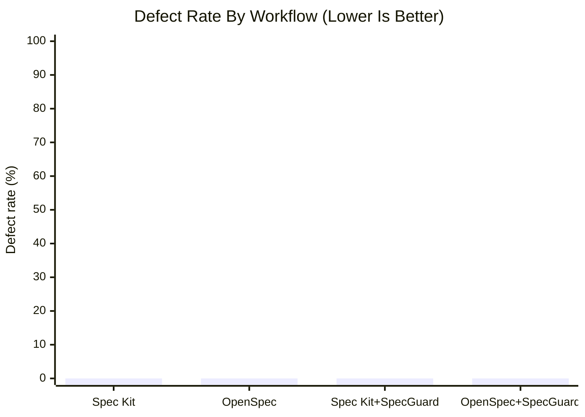
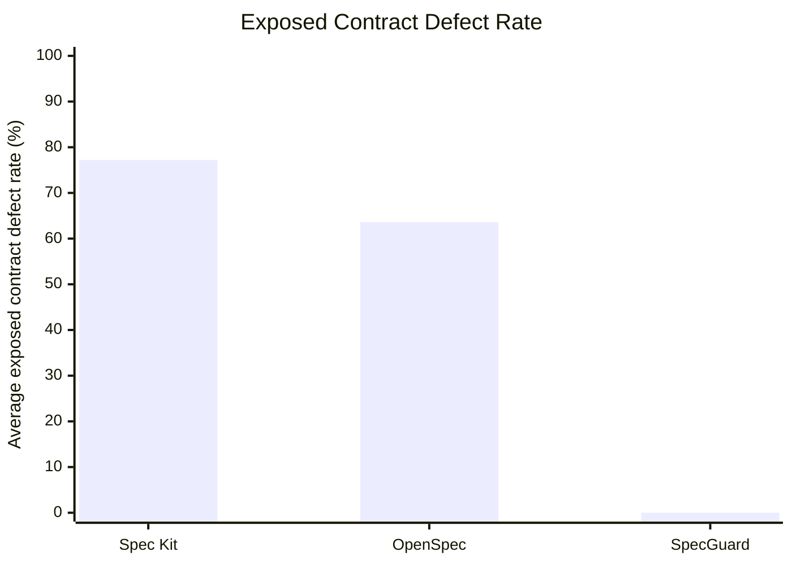
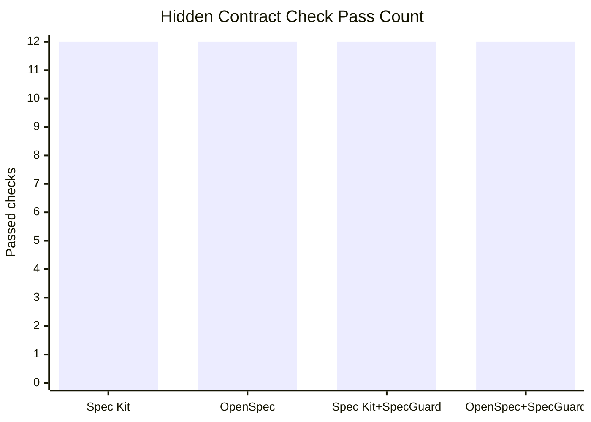
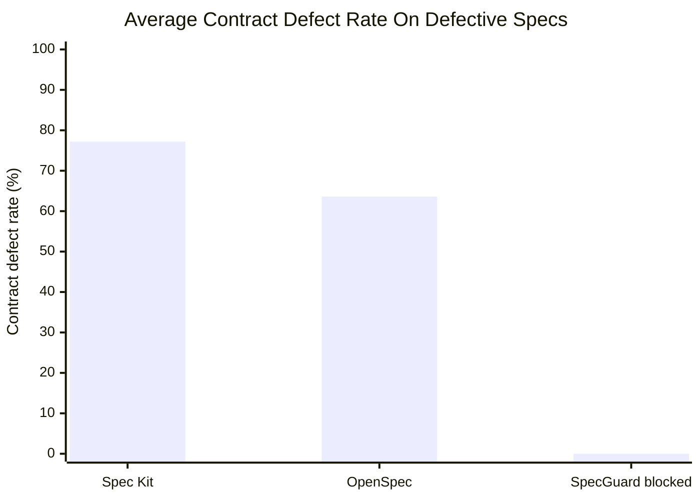

# Spec Kit, OpenSpec, SpecGuard Code Quality Benchmark

## 목적

이 문서는 동일한 스펙을 기준으로 Spec Kit, OpenSpec, SpecGuard 조합을 적용했을 때 실제 생성 코드의 결함률이 달라지는지 비교한다.

중점은 다음이다.

- 동일 과제와 동일 스펙에서 생성된 코드가 기능 요구사항을 만족하는가
- 응답 계약과 오류 계약에서 벗어나지 않는가
- 소유권, 상태 전이, idempotency 같은 구현 위험 지점을 놓치지 않는가
- SpecGuard를 추가했을 때 실제 결함률 개선이 관측되는가

## 결론 요약

Codex `gpt-5.5` 기준 완전 스펙 단일 과제에서는 네 방식 모두 hidden contract check 12개를 전부 통과했다.

따라서 완전하고 작은 스펙만 놓고 보면 코드 생성 결함률 차이는 관측되지 않았다.

| 방식 | 통과 | 실패 | 결함률 | 판정 |
| --- | ---: | ---: | ---: | --- |
| Spec Kit | 12 | 0 | 0% | 통과 |
| OpenSpec | 12 | 0 | 0% | 통과 |
| Spec Kit + SpecGuard | 12 | 0 | 0% | 통과 |
| OpenSpec + SpecGuard | 12 | 0 | 0% | 통과 |



하지만 동일 도메인에 결함 주입 스펙 3개와 불완전 스펙 3개를 투입한 확장 벤치마크에서는 차이가 명확하게 드러났다. Spec Kit과 OpenSpec은 모든 케이스에서 실제 코드를 생성했지만, 생성된 코드 12개 모두 hidden contract 위반을 포함했다. SpecGuard는 같은 6개 스펙 패키지를 모두 구현 전 차단했다.

| 방식 | 결함/불완전 스펙 | 생성 코드 | 평균 계약 결함률 | 계약 결함 발생 케이스 | 구현 전 차단 | 판정 |
| --- | ---: | ---: | ---: | ---: | ---: | --- |
| Spec Kit | 6 | 6 | 77.2% | 6/6 | 0/6 | 결함 코드 생성 |
| OpenSpec | 6 | 6 | 63.6% | 6/6 | 0/6 | 결함 코드 생성 |
| SpecGuard | 6 | 0 | N/A | 0/6 exposed | 6/6 | 구현 전 차단 |



SpecGuard의 `0%`는 결함 스펙에서 더 좋은 코드를 생성했다는 뜻이 아니다. SpecGuard가 `implementation_ready=false`로 구현을 차단했기 때문에 결함 코드가 실행 환경에 노출되지 않았다는 의미다.

이번 결과의 의미는 명확하다.

- 스펙이 충분히 명확하고 단일 모듈 수준이면 `gpt-5.5`는 네 방식 모두에서 계약을 만족하는 코드를 생성했다.
- 이 조건에서는 SpecGuard의 추가 효과가 코드 생성 결함률 감소로 드러나지 않았다.
- SpecGuard의 차별점은 더 나은 코드를 직접 생성하는 것이 아니라, 불완전한 구현 입력을 차단하고 승인된 스펙 기준으로 handoff와 PR review를 통제하는 것이다.
- SpecGuard의 장점은 완전 스펙 코드 생성 벤치마크보다 불완전 스펙 차단, 결함 스펙 차단, contract handoff, PR drift 검증에서 더 잘 드러난다.

## 근거와 신뢰 수준

| 신뢰 수준 | 의미 | 이 문서의 자료 |
| --- | --- | --- |
| E0 | 로컬에서 실제 실행한 결과 | 임시 프로젝트에서 Codex `gpt-5.5` 코드 생성 16회, hidden contract runner 검사, SpecGuard readiness gate 10개 케이스 검사 |
| E1 | 공식 문서와 공식 저장소 근거 | Spec Kit, OpenSpec, SpecGuard 공식 문서의 workflow와 artifact 구조 |
| E2 | E0/E1 기반 해석 | 결함률 비교, 도구 효과 해석, 한계 분석 |

공식 근거 자료:

| 도구 | 자료 |
| --- | --- |
| Spec Kit | [github/spec-kit README](https://github.com/github/spec-kit), [Spec-Driven Development methodology](https://github.com/github/spec-kit/blob/main/spec-driven.md) |
| OpenSpec | [OpenSpec official site](https://openspec.dev/), [Fission-AI/OpenSpec README](https://github.com/Fission-AI/OpenSpec) |
| SpecGuard | [README](../README.md), [Workflow Guide](workflow.md) |

## 벤치마크 조건

| 항목 | 값 |
| --- | --- |
| 실행일 | 2026-05-06 |
| 생성 명령 | `npx @openai/codex@0.128.0 exec -m gpt-5.5` |
| reasoning effort | `low` |
| 구현 과제 | 순수 Python in-memory `TaskService` |
| 산출 파일 | `task_service.py` |
| 외부 의존성 | 없음 |
| 평가 방식 | 동일한 Python hidden contract runner 12개 검사 |
| 임시 프로젝트 | `%TEMP%\\specguard-sdd-quality-benchmark-final-55-*` |
| 임시 프로젝트 삭제 | 최종 유효 실행 루트 삭제 확인: `temp_removed=True` |

## 동일 스펙 통제

스펙 차이로 인한 벤치마킹 왜곡을 막기 위해 네 방식 모두 동일한 canonical spec을 사용했다.

방식별 차이는 스펙 내용이 아니라 artifact 포장 방식만 다르다.

| 방식 | 입력 구조 | 스펙 내용 |
| --- | --- | --- |
| Spec Kit | Spec Kit-style `spec.md`, `plan.md`, `tasks.md` wrapper | 동일 canonical spec |
| OpenSpec | OpenSpec-style proposal/design/spec delta wrapper | 동일 canonical spec |
| Spec Kit + SpecGuard | Spec Kit wrapper + SpecGuard readiness/contract/handoff wrapper | 동일 canonical spec |
| OpenSpec + SpecGuard | OpenSpec wrapper + SpecGuard readiness/contract/handoff wrapper | 동일 canonical spec |

SpecGuard wrapper는 새로운 요구사항을 추가하지 않고, 동일 canonical spec을 readiness, contract, verification artifact로 재표현하는 것으로 제한했다.

## 평가 스펙 요약

| 영역 | 요구사항 |
| --- | --- |
| Public API | `TaskService`, `TaskError`, `create_task`, `list_tasks`, `complete_task`, `delete_task` |
| 성공 응답 | 정확히 `schema_version`, `correlation_id`, `task_id`, `owner_user_id`, `title`, `status`, `created_at`, `updated_at` |
| 오류 응답 | 정확히 `schema_version`, `correlation_id`, `error_code`, `message` |
| 오류 코드 | `UNAUTHENTICATED`, `INVALID_TITLE`, `TASK_NOT_FOUND`, `IDEMPOTENCY_KEY_REUSED` |
| 검증 | `user_id`, `title`는 trim 후 검증 |
| 소유권 | 다른 사용자의 task는 list/complete/delete 불가 |
| 상태 전이 | `open -> completed`, `completed -> completed`, `open/completed -> deleted` |
| idempotency | 같은 user/key/title은 같은 task 반환, 같은 user/key/different title은 거절 |
| 금지 범위 | HTTP, DB, repository layer, auth provider, background job |

## Hidden Contract Checks

총 12개 검사를 수행했다.

| 번호 | 검사 항목 |
| ---: | --- |
| 1 | create 응답의 필드 exact match, title trim, owner trim |
| 2 | blank title이 `INVALID_TITLE`과 flat error schema를 반환 |
| 3 | non-string title이 `INVALID_TITLE` 반환 |
| 4 | 100자 초과 title이 `INVALID_TITLE` 반환 |
| 5 | blank user가 `UNAUTHENTICATED` 반환 |
| 6 | non-string user가 `UNAUTHENTICATED` 반환 |
| 7 | 같은 idempotency key/title이 같은 task id 반환 |
| 8 | 같은 idempotency key/different title이 `IDEMPOTENCY_KEY_REUSED` 반환 |
| 9 | list가 owner scope와 deleted hiding 보장 |
| 10 | cross-user complete가 `TASK_NOT_FOUND` 반환 |
| 11 | completed task 재완료가 idempotent |
| 12 | deleted task 숨김 및 이후 접근 차단 |

결함률 계산식:

```text
defect_rate = failed_hidden_checks / total_hidden_checks * 100
```

## 실제 실행 결과

| 방식 | 모델 | Codex CLI | 생성 성공 | 실행 시간 | 통과 | 실패 | 결함률 |
| --- | --- | --- | --- | ---: | ---: | ---: | ---: |
| Spec Kit | `gpt-5.5` | `0.128.0` | 예 | 94.9초 | 12 | 0 | 0% |
| OpenSpec | `gpt-5.5` | `0.128.0` | 예 | 85.7초 | 12 | 0 | 0% |
| Spec Kit + SpecGuard | `gpt-5.5` | `0.128.0` | 예 | 132.7초 | 12 | 0 | 0% |
| OpenSpec + SpecGuard | `gpt-5.5` | `0.128.0` | 예 | 55.9초 | 12 | 0 | 0% |



## 확장 벤치마크: 결함 및 불완전 스펙

완전 스펙 코드 생성 벤치마크만으로는 SpecGuard의 역할을 보여주기 어렵다. 이미 승인 가능한 스펙을 코드 생성기에 넘겼을 때의 결과만 측정하기 때문이다.

그래서 두 번째 벤치마크는 의도적으로 결함이 있거나 불완전한 스펙을 사용했다. Spec Kit과 OpenSpec은 같은 결함 스펙을 그대로 `gpt-5.5`에 넘겨 실제 코드를 생성했다. SpecGuard는 같은 스펙 패키지를 먼저 gate에 넣고, `implementation_ready=false`이면 코드 생성을 차단했다.

### 측정 조건

| 항목 | 값 |
| --- | --- |
| 실행일 | 2026-05-06 |
| 실행 스크립트 | [tools/spec_driven_ai_benchmark.py](../tools/spec_driven_ai_benchmark.py) |
| 코드 생성 명령 | `npx @openai/codex@0.128.0 exec -m gpt-5.5` |
| SpecGuard gate | `python -m cli.specguard run <temp-feature> --no-llm --no-follow-up` |
| 생성 대상 | `task_service.py` |
| 케이스 수 | 결함 주입 3개, 불완전 스펙 3개 |
| 평가 방식 | hidden runner 21개 검사: 구조/실행 품질 10개, 계약 검사 11개 |
| 임시 프로젝트 | `%TEMP%\\specguard-ai-benchmark-55-*` |
| 임시 프로젝트 삭제 | 최종 실행 루트 삭제 확인: `temp_removed=True` |

hidden runner는 의도적으로 전체 canonical contract를 알고 있다. 따라서 결함 스펙이나 불완전 스펙을 그대로 구현했을 때, 빠진 계약이 실제 실행 결과에서 어떻게 위반되는지 측정한다.

### 케이스 설계

| 분류 | 케이스 | 스펙 문제 |
| --- | --- | --- |
| 결함 주입 | `fault_ownership_leak` | `list/complete/delete`가 owner scope를 강제하지 않도록 스펙이 잘못 작성됨 |
| 결함 주입 | `fault_deleted_visible` | 삭제된 task를 계속 list에 노출하고 complete 허용 |
| 결함 주입 | `fault_external_dependency` | 외부 notification 호출은 요구하지만 실패 정책이 없음 |
| 불완전 스펙 | `incomplete_error_contract` | 오류 응답 schema, error code, correlation id 계약 누락 |
| 불완전 스펙 | `incomplete_idempotency` | idempotency key 충돌 규칙 누락 |
| 불완전 스펙 | `incomplete_state_transition` | 상태 전이와 deleted terminal 규칙 누락 |

### 전체 집계

| 방식 | 생성 코드 | 평균 구조 품질 | 평균 계약 결함률 | 계약 결함 발생 케이스 | SpecGuard 차단률 |
| --- | ---: | ---: | ---: | ---: | ---: |
| Spec Kit | 6 | 100.0% | 77.2% | 6/6 | 0% |
| OpenSpec | 6 | 100.0% | 63.6% | 6/6 | 0% |
| SpecGuard | 0 | N/A | N/A | 0/6 exposed | 100.0% |

구조 품질 100%는 생성 코드가 import 가능하고, `TaskService`/`TaskError`/공개 메서드가 존재했다는 뜻이다. 즉 Spec Kit과 OpenSpec 산출물은 겉으로는 정상적인 코드였지만, 실행 계약에서는 모든 케이스가 실패했다.



### 결함 주입 스펙 결과

| 케이스 | Spec Kit 계약 결함률 | OpenSpec 계약 결함률 | SpecGuard 결과 |
| --- | ---: | ---: | --- |
| `fault_ownership_leak` | 63.6% | 63.6% | `not_ready`, 구현 차단 |
| `fault_deleted_visible` | 63.6% | 54.5% | `not_ready`, 구현 차단 |
| `fault_external_dependency` | 90.9% | 63.6% | `not_ready`, 구현 차단 |

결함 주입 스펙에서는 AI가 스펙의 잘못된 계약을 충실히 구현하는 경향이 나타났다. 예를 들어 owner scope가 빠진 스펙에서는 cross-user complete가 허용되거나, 삭제된 task가 계속 노출되는 코드가 생성됐다.

### 불완전 스펙 결과

| 케이스 | Spec Kit 계약 결함률 | OpenSpec 계약 결함률 | SpecGuard 결과 |
| --- | ---: | ---: | --- |
| `incomplete_error_contract` | 81.8% | 81.8% | `validation_blocked`, 구현 차단 |
| `incomplete_idempotency` | 81.8% | 54.5% | `validation_blocked`, 구현 차단 |
| `incomplete_state_transition` | 81.8% | 63.6% | `validation_blocked`, 구현 차단 |

불완전 스펙에서는 생성 코드가 실행 가능하더라도 error schema, idempotency conflict, deleted terminal state 같은 계약을 안정적으로 맞추지 못했다. 이 경우 SpecGuard는 readiness report 이전의 validation 단계에서 placeholder나 불완전한 기술 설계를 차단했다.

### 실행 환경에서의 결함 노출

계약 결함률 계산식:

```text
contract_defect_rate = failed_contract_checks / total_contract_checks * 100
```

실행 환경 기준으로 보면 차이는 다음과 같다.

| 방식 | 실행 환경에 노출된 코드 | 결함 노출 케이스 | 평균 노출 계약 결함률 |
| --- | ---: | ---: | ---: |
| Spec Kit | 6 | 6/6 | 77.2% |
| OpenSpec | 6 | 6/6 | 63.6% |
| SpecGuard | 0 | 0/6 | 0% |

SpecGuard의 0%는 생성 코드의 품질 점수가 아니다. 결함 또는 불완전 스펙을 구현 입력으로 넘기지 않았기 때문에 결함 코드가 실행 환경에 올라가지 않았다는 운영 지표다.

### 이 결과가 보여주는 SpecGuard의 장점

SpecGuard는 Spec Kit이나 OpenSpec을 대체하는 코드 생성 프레임워크가 아니다. 두 도구가 만든 스펙 산출물을 구현 가능한 입력으로 승격하기 전에 다음 질문을 강제하는 검증 계층이다.

- 이 스펙으로 구현하면 코드 생성기가 추측해야 하는 부분이 남아 있는가
- 소유권, 삭제, 외부 의존성 실패처럼 결함으로 이어질 수 있는 요구사항이 빠져 있는가
- Critical 또는 Major blocker가 남아 있는데도 구현을 시작하려고 하는가
- 생성된 코드가 실행 환경에 올라가기 전에 계약 위반 가능성을 차단했는가

따라서 이번 확장 벤치마크의 결론은 “SpecGuard가 불완전하거나 결함이 있는 스펙으로 AI 코드를 생성할 때 더 좋은 코드를 만든다”가 아니다. 더 정확한 결론은 “SpecGuard는 불완전하거나 결함이 있는 스펙을 AI 코드 생성 입력으로 넘기지 않기 때문에, 결함 코드가 생성되고 실행 환경에 노출되는 경로를 차단한다”이다.

## 해석

### 코드 품질

완전 스펙 단일 과제에서는 네 방식 모두 성공 응답 계약, 오류 응답 계약, owner isolation, 상태 전이, idempotency를 만족했다.

반대로 결함 및 불완전 스펙 과제에서는 Spec Kit과 OpenSpec이 생성한 코드 모두 구조 품질은 100%였다. 파일이 생성되고, import가 가능하고, 공개 API가 존재했다. 문제는 구조가 아니라 계약이었다.

### 계약 이탈

완전 스펙에서는 계약 이탈이 관측되지 않았다.

| 방식 | 계약 이탈 |
| --- | ---: |
| Spec Kit | 0 |
| OpenSpec | 0 |
| Spec Kit + SpecGuard | 0 |
| OpenSpec + SpecGuard | 0 |

결함 및 불완전 스펙에서는 계약 이탈이 모든 생성 코드에서 관측됐다.

| 방식 | 생성 코드 | 계약 결함 발생 | 평균 계약 결함률 |
| --- | ---: | ---: | ---: |
| Spec Kit | 6 | 6/6 | 77.2% |
| OpenSpec | 6 | 6/6 | 63.6% |
| SpecGuard | 0 | 0/6 exposed | 0% exposed |

### SpecGuard 효과

완전 스펙 코드 생성 실험에서는 SpecGuard 추가가 결함률을 더 낮추지 않았다. 이미 모든 방식이 0% 결함률이었기 때문이다.

반면 결함 및 불완전 스펙 실험에서는 SpecGuard가 6개 케이스를 전부 구현 전 차단했다. 이 결과에서 확인되는 범위는 다음이다.

- 명확하고 작은 단일 스펙에서는 `gpt-5.5` 자체가 충분히 강했다.
- SpecGuard는 코드 생성 모델을 대체하지 않고, 구현 입력의 품질을 통제한다.
- 결함 또는 불완전 스펙에서는 SpecGuard가 `implementation_ready=false` 또는 validation block으로 구현을 시작하지 못하게 한다.
- Spec Kit과 OpenSpec만으로 생성한 코드는 실행 가능한 형태였지만, 숨은 계약 기준에서는 모든 케이스가 결함을 포함했다.
- stale spec 차단, OpenAPI path 누락, PR diff와 승인 스펙 비교 같은 PR gate 효과는 별도 PR drift 벤치마크로 더 확장할 수 있다.

## 최종 판정

| 질문 | 이번 실험의 답 |
| --- | --- |
| 실제 코드를 생성했는가 | 예 |
| 동일 스펙으로 비교했는가 | 예 |
| `gpt-5.5` 기준인가 | 예 |
| 결함률을 계산했는가 | 예 |
| 임시 프로젝트를 제거했는가 | 최종 유효 실행 루트는 제거 확인 |
| 가장 코드 품질이 좋은 방식은 무엇인가 | 완전 스펙에서는 동률, 결함/불완전 스펙에서는 SpecGuard가 결함 노출을 차단 |
| SpecGuard 도입으로 결함률이 줄었는가 | 완전 스펙에서는 추가 감소 없음, 결함/불완전 스펙에서는 exposed contract defect를 0건으로 차단 |
| SpecGuard의 장점이 확인되었는가 | 결함/불완전 스펙 gate에서 6/6 구현 전 차단 |
| SpecGuard를 어떻게 포지셔닝해야 하는가 | 코드 생성기보다 구현 입력 검증 및 PR drift 통제 계층 |

## 한계

- 단일 과제, 단일 실행이므로 통계적 우위를 주장할 수 없다.
- 완전 스펙 canonical spec 자체가 충분히 명확해 그 실험에서는 도구별 차이가 드러나기 어려웠다.
- 확장 벤치마크는 결함/불완전 스펙 6개를 사용했지만 반복 실행은 1회다.
- hidden runner는 runtime behavior와 DTO 계약을 검증했지만, 장기 유지보수성, 확장성, 실제 PR drift, stale readiness는 측정하지 않았다.
- Spec Kit과 OpenSpec 공식 CLI의 전체 slash command 흐름을 실행한 것이 아니라, 공식 artifact 구조를 반영한 controlled prompt 방식이다.
- SpecGuard gate는 이번 실행에서 `--no-llm` local heuristic review 기준이다. LLM 기반 strict review와 실제 PR diff review를 포함하면 추가 지표가 필요하다.
- Spec Kit과 OpenSpec 단독 행은 별도 커스텀 검증기나 사람 리뷰를 붙이지 않은 baseline이다. 두 도구에 추가 validator를 붙이면 결과는 달라질 수 있다.

## 더 강한 후속 벤치마크 설계

통계적 주장을 강화하려면 다음 실험이 필요하다.

| 항목 | 권장 방식 |
| --- | --- |
| 기능 수 | 인증, 권한 경계, 결제 webhook, 상태 머신, OpenAPI CRUD 등 5개 이상 |
| 반복 수 | 방식별 기능당 3회 이상 |
| 스펙 통제 | 동일 canonical spec을 사용하고 tool별 artifact는 동일 요구사항의 변환만 허용 |
| 평가 지표 | hidden tests, OpenAPI response exact match, mutation tests, static analysis, PR diff review |
| 결함 분류 | 기능 누락, 계약 이탈, 권한 누락, 상태 전이 오류, idempotency 오류, 스펙 외 기능 추가 |
| 통계 | 평균 결함률, 중앙값, 표준편차, worst-case failure count |
| SpecGuard 특화 지표 | readiness blocker detection rate, false positive rate, PR drift detection rate, stale artifact block rate |

이 수준의 반복 실험을 수행해야 “SpecGuard가 평균적으로 결함률을 낮춘다” 또는 “명확한 스펙에서는 차이가 없다”를 통계적으로 주장할 수 있다.
